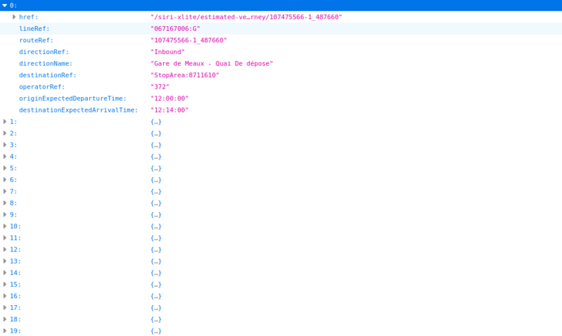

# siri-xlite
## Service lines discovery
    /siri-xlite/lines-discovery
    
### ex: https://localhost:8443/siri-xlite/lines-discovery    

## Service stoppoints discovery
    /siri-xlite/stoppoints-discovery
        
    /siri-xlite/stoppoints-discovery/[xtile]/[ytile]
    
### ex: https://localhost:8443/siri-xlite/stoppoints-discovery/33194/22549

### Pseudocode longitude/latitude -> xtile/ytile
    n = 2 ^ zoom
    xtile = n * ((lon_deg + 180) / 360)
    ytile = n * (1 - (log(tan(lat_rad) + sec(lat_rad)) / π)) / 2
    
###  Pseudocode xtile/ytile -> longitude/latitude
    n = 2 ^ zoom
    lon_deg = xtile / n * 360.0 - 180.0
    lat_rad = arctan(sinh(π * (1 - 2 * ytile / n)))
    lat_deg = lat_rad * 180.0 / π
    

## Service estimated timetable
    /siri-xlite/estimated-timetable/[lineRef]
### ex: https://localhost:8443/siri-xlite/estimated-timetable/067167006:G

## Service stop monitoring
    /siri-xlite/stop-monitoring/[stopPointRef]
    
### ex:  https://localhost:8443/siri-xlite/stop-monitoring/StopArea:59:3893358

## Service estimated vehicle journey
    /siri-xlite/estimated-vehicle-journey/[datedVehicleJourneyRef]
### ex:  https://localhost:8443/siri-xlite/estimated-vehicle-journey/107707296-1_447664

