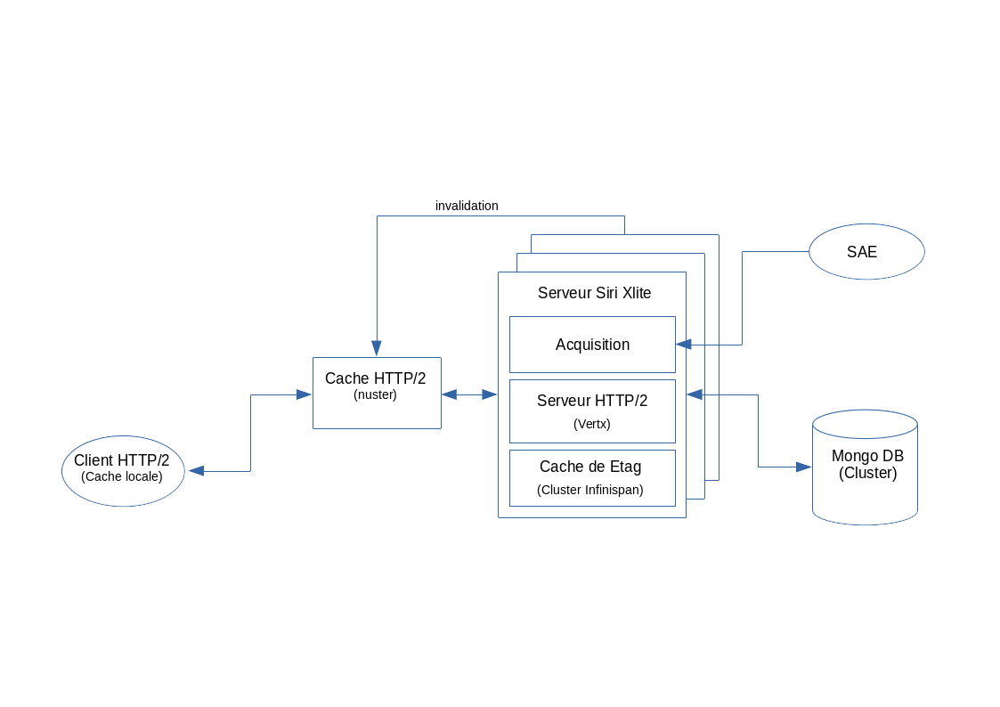
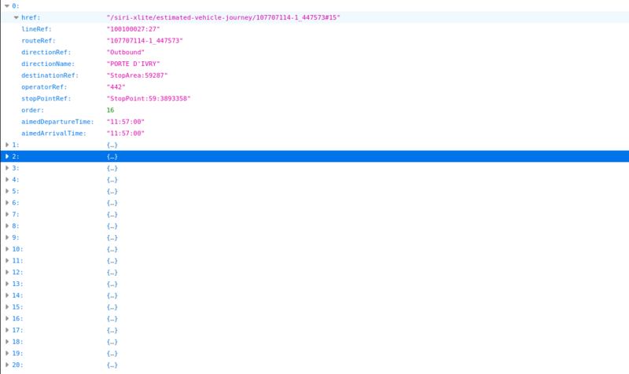

# SIRI XLite

## SIRI et SIRI Lite

La norme SIRI (Service Interface for Real time Information) définit le protocole publication d'information transport.
Le Profil SIRI France est défini [ici](http://www.normes-donnees-tc.org/wp-content/uploads/2020/02/BNTRA-CN03-GT7_NF-Profil-SIRI-FR_v0.9v.pdf).
Les services SIRI sont définis comme un ensemble de services SOAP Web service en mode Requête/Réponse et/ou Abonnement/Notification.

Chaque service dispose de nombreux paramètres  et les structures XML échangées sont extrêmement verbeuses avec une importante profondeur hiérarchique.

Le choix d'une API SOAP induit une complexité dans les échanges et ne permet pas une montée en charge du serveur. 
En effet le serveur SIRI doit être dimensionné non seulement en fonction de l'offre de transport, 
mais aussi en fonction du nombre de clients.

Afin de pallier ces problèmes, une proposition d'API SIRI Lite a été définie [ici](http://www.normes-donnees-tc.org/wp-content/uploads/2018/10/Proposition-Profil-SIRI-Lite-initial-v1-3.pdf). 
Cependant, celle-ci, ne constitue pas une véritable API REST. 
C'est une simple transcription d'un SOAP message en requête HTTP avec le même nombre de paramètres. 
La montée en charge du serveur et toute autant difficile.

## Proposition

SIRI Xlite propose une API REST HATEOS (Hypermedia as the Engine of Application State ) pour les principaux 
services LineDiscovery, StoppointsDiscovery, StopMonitoring, EstimatedTimetable utilisant 
le protocole HTTP/2 ( client HTTP/2 avec cache locale, cache serveur HTTP/2, Serveur HTTP/2 de type "event loop"). 

C’est-à-dire que chaque ressource est mise en cache (cache locale et cache serveur) et contrôlé par 
les directives HTTP Etag et Cache-Control (max-age, s-maxage, proxy-revalidate).

Le cache HTTP serveur (distant) dispose d’une API permettant l’invalidation d’une  ou plusieurs ressources 
lors de la modification de l’offre de transport ou la modification de l’état des courses (EstimatedVehicleJourney) par les SAE. 

Un cache cluster embarqué en mode invalidation permet l’optimisation de la revalidation du cache serveur HTTP.
Celui-ci est invalidé lors de la modification de l’offre de transport ou la modification de l’état des courses.

Les services SIRI StopMonitoring, EstimatedTimetable référence une ressource SIRI EstimatedVehicleJourney partagé.
Le service StoppointsDiscovery fournit la liste complète des points d’arrêt ou par tuile ( même tuilage que OpenStreetMap) 
Le service LineDiscovery fournit la liste des lignes.

Les ressources LineDiscovery, StoppointsDiscovery, StopMonitoring et EstimatedTimetable sont définies 
par l'offre de transport du jour. Leur duré de vie théorique est la journée.

La ressource partagée EstimatedVehicleJourney est référencée à la manière d'un hyper-lien (Xlink/Xpointer).

Le protocole HTTP/2, l’utilisation d’un serveur de type « event loop » et de cache HTTP/2 locale 
et serveur permet une optimisation des échanges avec le serveur siri-xlite.

## Remarques

Les services LineDiscovery et StoppointsDiscovery sont redondants avec la définition de l'offre de transport au format NEPTUNE ou NETEX.

Il serait plus intéressant  de publier l'offre de transport sous forme de ressources REST (HATEOS) NEPTUNE ou NETEX 
relié par des hyperliens (XPointer/Xlink).
Le remplacement des identifiants d'objet spécifique à un profil local par un hyperlien (Xlink/Xpointer) 
permettrait une plus grande interopérabilité des systèmes.

## Architecture

siri-xlite est une application SpringBoot (Java 11) de démonstration 
permettant la publication d'information transport de manière simple et performante.
 
Elle est constituée des composants logiciels suivants:
  
* Cache HTTP/2 (Varnish)
* Serveur HTTP/2 de type "event loop" (Vert.x-Web).
* Cache cluster en mode invalidation (Infinispan) pour la revalidation du cache HTTP.
* Base de données MongoDB
* API  REST (HATEOAS) implémentant les services SIRI LineDiscovery, StoppointsDiscovery, 
StopMonitoring, EstimatedTimetable (voir ci-dessous)

## Services Siri Xlite
### Service lines discovery
Ce service renvoie la liste des lignes définie dans l'offre de transport.

    GET /siri-xlite/lines-discovery
    
#### réponses

* 200 OK : Collection de structure SIRI AnnotatedLineRef[].
* 304 NOT_MODIFIED : re-validation du cache HTTP
* 400 BAD_REQUEST : structure SiriException
* 404 NOT_FOUND
* 500 INTERNAL_SERVEUR_ERROR 
  
### ex: https://localhost:8443/siri-xlite/lines-discovery    

### Service stoppoints discovery
Ce service renvoie la liste des points d'arrêt définie dans l'offre de transport (complète ou par tuile).

    GET /siri-xlite/stoppoints-discovery

#### réponses

    * 200 OK : Collection de structure SIRI AnnotatedStopPointRef.
    * 304 NOT_MODIFIED : re-validation du cache HTTP
    * 400 BAD_REQUEST : structure SiriException
    * 404 NOT_FOUND
    * 500 INTERNAL_SERVEUR_ERROR        

Ce service renvoie la liste des points d'arrêt définie dans l'offre de transport par tuile.
    
     GET /siri-xlite/stoppoints-discovery/[xtile]/[ytile]

#### paramètres

    Tuilage OpenStreetMap  (zoom = 15)  
    * xtile : Abscisse 
    * ytile : Ordonnée 
    
    Pseudo-code longitude/latitude -> xtile/ytile
        n = 2 ^ zoom
        xtile = n * ((lon_deg + 180) / 360)
        ytile = n * (1 - (log(tan(lat_rad) + sec(lat_rad)) / π)) / 2
        
    Pseudo-code xtile/ytile -> longitude/latitude
        n = 2 ^ zoom
        lon_deg = xtile / n * 360.0 - 180.0
        lat_rad = arctan(sinh(π * (1 - 2 * ytile / n)))
        lat_deg = lat_rad * 180.0 / π
    
#### réponses

    * 200 OK : Collection de structure SIRI AnnotatedStopPointRef.
    * 304 NOT_MODIFIED : re-validation du cache HTTP
    * 400 BAD_REQUEST : structure SiriException
    * 404 NOT_FOUND
    * 500 INTERNAL_SERVEUR_ERROR 
    
#### ex: https://localhost:8443/siri-xlite/stoppoints-discovery/33194/22549

### Service estimated timetable
Ce service renvoie la liste des courses sur une ligne définie dans l'offre de transport.

    GET /siri-xlite/estimated-timetable/[lineRef]
    
#### paramètres

    * lineRef : Identifiant de ligne.
   
#### réponses

    * 200 OK : Collection de référence de ressource estimated-vehicle-journey (+ méta-données).
    [
      {
          "href": url,
          "datedVehicleJourneyRef": string,
          "destinationRef": string,
          "routeRef": string,
          "operatorRef": string,
          "originAimedDepartureTime": timestamp
      },
     ...
    ]
    * 304 NOT_MODIFIED : re-validation du cache HTTP
    * 400 BAD_REQUEST : structure SiriException
    * 404 NOT_FOUND
    * 500 INTERNAL_SERVEUR_ERROR 
        
#### ex: https://localhost:8443/siri-xlite/estimated-timetable/067167006:G

### Service stop monitoring    
Ce service renvoie la liste des courses passant par un point d'arrêt défini dans l'offre de transport.

    GET /siri-xlite/stop-monitoring/[stopPointRef]
    
#### paramètres

    * stopPointRef : Identifiant de point d’arrêt (StopArea ou StopPoint).
   
#### réponses

    * 200 OK : Collection de référence de ressource estimated-vehicle-journey (+ méta-données).
    [ 
       {
         "href": url,
         "datedVehicleJourneyRef": string,
         "destinationRef": string,
         "routeRef": string,
         "operatorRef": string,
         "originAimedDepartureTime": timestamp,
         "aimedDepartureTime": timestamp,
         "order": 26,
         "index": 25
       },
       ...
    ]
    * 304 NOT_MODIFIED : re-validation du cache HTTP
    * 400 BAD_REQUEST : structure SiriException
    * 404 NOT_FOUND
    * 500 INTERNAL_SERVEUR_ERROR     
    
#### ex:  https://localhost:8443/siri-xlite/stop-monitoring/StopArea:59:3893358

### Service estimated vehicle journey
Ce service renvoie la course référencée par les services estimated-timetable et stop-monitoring.

    GET /siri-xlite/estimated-vehicle-journey/[datedVehicleJourneyRef]
     
#### paramètres

    * datedVehicleJourneyRef : Identifiant de course.
   
#### reponses

    * 200 OK : Structure SIRI EstimatedVehicleJourney.
    * 304 NOT_MODIFIED : re-validation du cache HTTP
    * 400 BAD_REQUEST : structure SiriException
    * 404 NOT_FOUND
    * 500 INTERNAL_SERVEUR_ERROR 
        
#### ex:  https://localhost:8443/siri-xlite/estimated-vehicle-journey/107707296-1_447664

#### Structure SiriException
    {
        "errorCode": """,
        "errorText": ""
    } 
    
SiriException OtherError

## TODO: 
* Unifier les structures EstimatedVehicleJourney et MonitoredVehicleJourney 
de définition des courses.   
* Service connection-monitoring de gestion des correspondances.
* Service situation-exchange de gestion des perturbations.
* Publier les fichiers NETEX de définition d'offre de transport 
sous forme de service REST HATEOAS.
