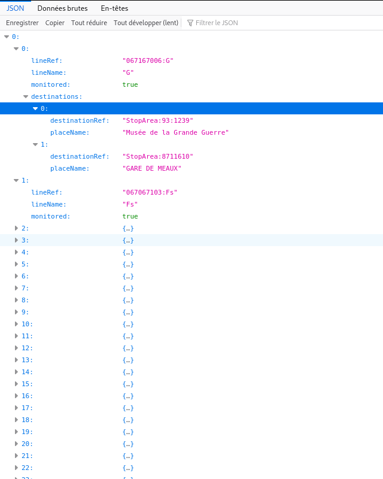

# SIRI XLite

## SIRI et SIRI Lite

La norme SIRI (Service Interface for Real time Information) définit le protocole publication d'information transport.
Le Profil SIRI France est défini [ici](http://www.normes-donnees-tc.org/wp-content/uploads/2020/02/BNTRA-CN03-GT7_NF-Profil-SIRI-FR_v0.9v.pdf).
Les services SIRI sont définis comme un ensemble de service SOAP Web service en mode Requête/Réponse et/ou Abonnement/Notification.

Chaque service dispose de nombreux paramètres  et les structures XML échangées sont extrêmement verbeuse avec une importante profondeur hiérarchique.

Le choix d'une API SOAP induit une complexité dans les échanges et ne permet pas une monté en charge du serveur. En effet le serveur SIRI doit être dimensionne non seulement en fonction de l'offre de transport, mais aussi en fonction du nombre de client.

Afin de palier à ces problèmes, une proposition d' API SIRI Lite à été définie [ici](http://www.normes-donnees-tc.org/wp-content/uploads/2018/10/Proposition-Profil-SIRI-Lite-initial-v1-3.pdf). Cependant, celle ci, ne constitue pas une véritable API REST. C'est une simple transcription d'un SOAP message en requête HTTP avec le même nombre paramétrés. La monté en charge du serveur et toute autant difficile.

## Proposition

SIRI Xlite propose une API REST HATEOS (Hypermedia as the Engine of Application State ) pour les principaux  services LineDiscovery, StoppointsDiscovery, StopMonitoring, EstimatedTimetable utilisant le protocole HTTP/2 ( client HTTP/2 avec cache locale, cache serveur HTTP/2, Serveur HTTP/2 de type "event loop"). 

C’est a dire que chaque ressource est mis en cache (cache locale et cache serveur) et contrôlé par les directive HTTP
Etag et Cache-Control (max-age, s-maxage, proxy-revalidate).

Le cache HTTP serveur (distant) dispose d’une API permettant l’invalidation d’une  ou plusieurs ressources lors de la modification de l’offre de transport ou la modification de l’état des courses (EstimatedVehicleJourney) par les SAE. 

Un cache cluster embarqué en mode invalidation permet l’optimisation de la re-validation du cache serveur HTTP.
Celui ci est invalidé lors de la modification de l’offre de transport ou la modification de l’état des courses.

Les services SIRI StopMonitoring, EstimatedTimetable référence une ressource SIRI EstimatedVehicleJourney partagé.
Le service StoppointsDiscovery fournit la liste complète des points d’arrêt ou par tuile ( même tuilage que OpenStreetMap) 
Le service LineDiscovery fournit la liste des lignes.

Les ressources LineDiscovery, StoppointsDiscovery, StopMonitoring et EstimatedTimetable sont définie par l'offre de transport du jour. Leur duré de vie théorique est la journée.

La ressource partagé EstimatedVehicleJourney est référencé à la manière d'un hyper lien (Xlink/Xpointer).

Le protocole HTTP/2, l’utilisation d’un serveur de type « eventloop » et de cache HTTP/2 locale et serveur permet une optimisation des échanges avec le serveur siri-xlite.

##Remarques:
Les services LineDiscovery et StoppointsDiscovery sont redondant avec la definition de l'offre de transport aux format NEPTUNE ou NETEX.

Il serait plus intéressant  de publier l'offre de transport sous forme de ressources REST (HATEOS) NEPTUNE ou NETEX relier par des hyperlien (XPointer/Xlink).
Le remplacement des identifiants d'objet spécifique à un profile locale par un hyperlien (Xlink/Xpointer) permetterait une plus grande intéropabilité des systemes.
 

## Architecture

siri-xlite est une application SpringBoot (Java 11) de démonstration 
permettant la publication d'information transport de manière simple et performante.
 

Elle est constitué des composants logiciels suivant:
  
* Cache HTTP/2 (Varnish)
* Serveur HTTP/2 de type "event loop" (Vert.x-Web).
* Cache cluster en mode invalidation (Infinispan) pour la revalidation du cache HTTP.
* Base de données MongoDB
* API Rest (HATEOAS) implémentant les services SIRI LineDiscovery, StoppointsDiscovery, 
StopMonitoring, EstimatedTimetable, VehicleMonitoring (voir ci-dessous)

## Service Siri Xlite
### Service lines discovery
    /siri-xlite/lines-discovery
    
### ex: https://localhost:8443/siri-xlite/lines-discovery    

### Service stoppoints discovery
    /siri-xlite/stoppoints-discovery
        
    /siri-xlite/stoppoints-discovery/[xtile]/[ytile]
    
#### ex: https://localhost:8443/siri-xlite/stoppoints-discovery/33194/22549

#### Pseudocode longitude/latitude -> xtile/ytile
    n = 2 ^ zoom
    xtile = n * ((lon_deg + 180) / 360)
    ytile = n * (1 - (log(tan(lat_rad) + sec(lat_rad)) / π)) / 2
    
####  Pseudocode xtile/ytile -> longitude/latitude
    n = 2 ^ zoom
    lon_deg = xtile / n * 360.0 - 180.0
    lat_rad = arctan(sinh(π * (1 - 2 * ytile / n)))
    lat_deg = lat_rad * 180.0 / π
    

### Service estimated timetable
    /siri-xlite/estimated-timetable/[lineRef]
#### ex: https://localhost:8443/siri-xlite/estimated-timetable/067167006:G

### Service stop monitoring
    /siri-xlite/stop-monitoring/[stopPointRef]
    
#### ex:  https://localhost:8443/siri-xlite/stop-monitoring/StopArea:59:3893358

### Service estimated vehicle journey
    /siri-xlite/estimated-vehicle-journey/[datedVehicleJourneyRef]
#### ex:  https://localhost:8443/siri-xlite/estimated-vehicle-journey/107707296-1_447664

